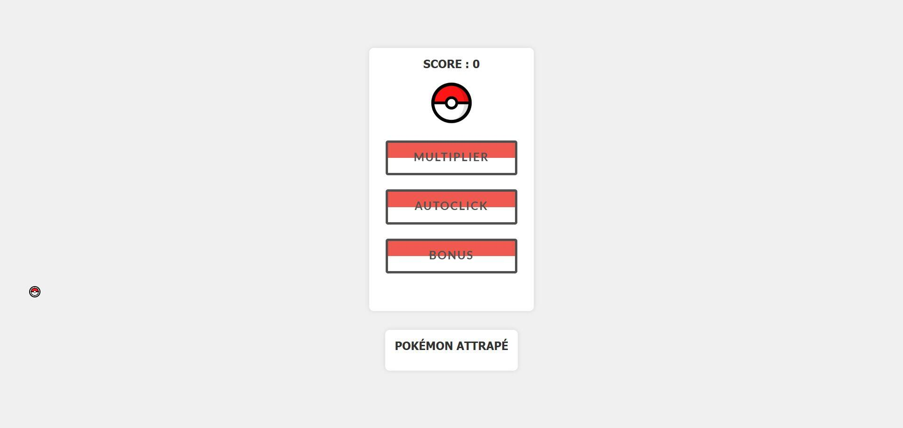
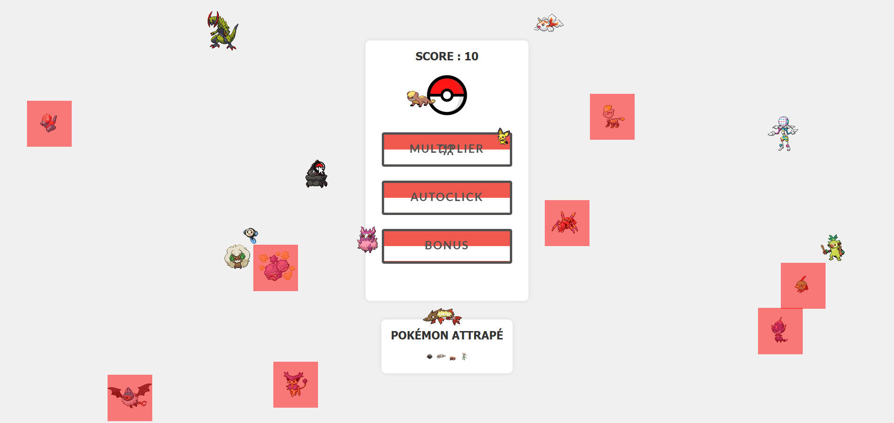
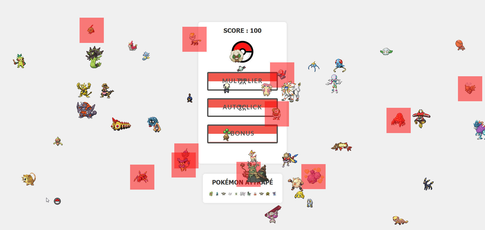

# Pokeclicker

> Idle game où l'on capture des Pokémon pour faire grimper son score. JavaScript pur et PokéAPI. Ce n'est pas un fork : codé par moi.

> Version réécrite en React, jouable sans rien installer : https://aboeka.fr/projects/pokeclicker

## Captures

| | | |
|---|---|---|
|  |  |  |

L'interface d'origine : l'arène, les Pokémon à capturer et les améliorations à acheter.

## Contexte

Un de mes premiers jeux, écrit en JavaScript pur pendant ma formation Technicien Intégrateur Web (Buroscope). Ce n'est pas un fork du jeu open-source du même nom : je l'ai codé moi-même, pour apprendre les mécaniques d'un idle game et le travail avec une API publique.

Le principe : des Pokémon se baladent dans l'arène, on clique pour les capturer et marquer des points, puis on réinvestit ces points dans des améliorations (multiplicateur, autoclick, bonus) qui font gagner toujours plus vite. Certains Pokémon rouges sont des malus à éviter. Les sprites et les données viennent en direct de l'API publique PokéAPI.

Le code du jeu vit dans le sous-dossier `pokeclicker/`.

## Stack

- JavaScript pur (logique de jeu, boucle d'animation)
- HTML et CSS
- PokéAPI (sprites et données des Pokémon)

## Statut

Ancien projet personnel, conservé en archive. Pas activement maintenu. Je le garde comme trace de mes débuts. Une version réécrite proprement en React est jouable sur mon site, avec son guide et son onglet Méthode : https://aboeka.fr/projects/pokeclicker

## Roadmap (si je devais le refaire aujourd'hui)

- Réécrire en TypeScript strict avec Vite, en isolant proprement la logique de jeu du DOM.
- Système de mods (chargement de packs de Pokémon, événements scriptés).
- Sauvegarde en IndexedDB plutôt qu'en localStorage (volume et structure).
- Agent IA (Claude) qui joue selon une stratégie prédéfinie (autoclic intelligent, allocation des captures, optimisation du score).
- Mode multijoueur léger via WebSocket (échanges de Pokémon entre amis).